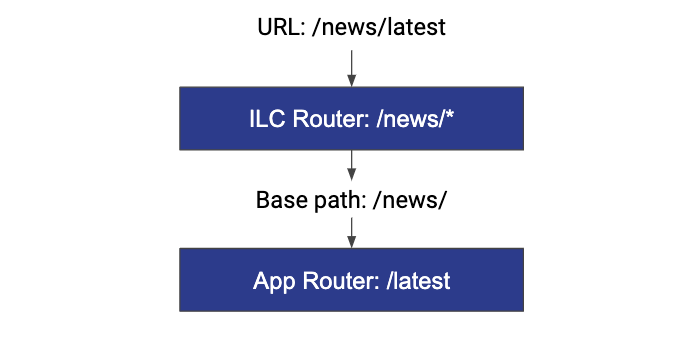
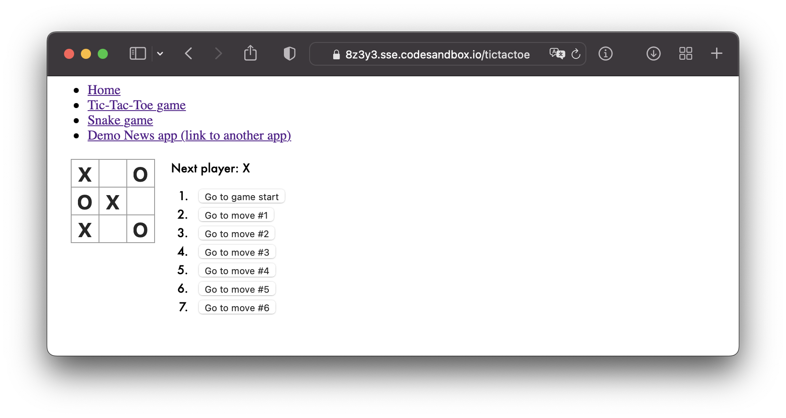
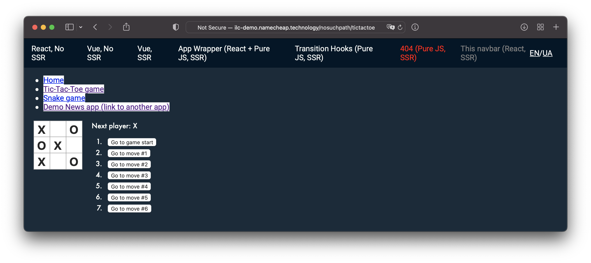

# React application + ILC. Lesson 2

Hello everyone!

In the [first tutorial](lesson1.md), you created a React application from scratch and integrated it into a "production" instance of ILC on-the-fly.

In this tutorial, you will get familiar with the routing and turn your application (from the previous tutorial) into a micro-frontend that works with ILC.

Let's get started 🚀

## Overview

Routing is one of the hard questions to solve when applying the micro-frontend architecture. The problem is that you no longer have a single application that handles all the route transitions. Instead, you have multiple applications working simultaneously on the web page, and you need to know what application should be active at one time or another for the current URL.

ILC uses **two-tiered routing** to solve this problem.



In this example, when the user opens a URL (`/news/latest`), this URL matches the route configured in ILC (`/news/*`). The route contains information about the applications that should be loaded on the page and the props they need to receive.
When ILC loads and mounts the application to its DOM node container, it also passes the `basePath` property to instruct the application on what routing it should use.

!!! info ""
    You can find more information about routing in the [Introduction](../../routing/introduction.md) page.

## Get your React application ready

For this tutorial, you need the [React application](lesson1.md) with the following internal routes: Home, Tic-Tac-Toe, and Snake games.

To make things easier, you can [clone the sample](https://github.com/StyleT/ilc-learning-react/tree/step_2-Router) that we've prepared for you (and then checkout to the `step_2-Router` branch), or start with this application [running in the cloud](https://codesandbox.io/s/github/StyleT/ilc-learning-react/tree/step_2-Router). For the sake of simplicity, it is recommended to use the cloud version.

!!! hint ""
    Don't forget to play around with links, games, and check the [diff with the `master` branch](https://github.com/StyleT/ilc-learning-react/compare/step_2-Router?diff=split) before we actually get started 😎




## Adapt the application to ILC

To make the application work correctly with ILC, you need to make it compliant with the [ILC to App interface](https://namecheap.github.io/ilc-sdk/pages/Pages/ilc_app_interface.html).

To do this, go through the source code and resolve **all** the `//TODO:` comments that were placed there for you (Hint: there are still 4 of them 😉)

Once you're done, restart the application and navigate to the `/microfrontend` route. You should get a `200 OK` response code and SSR markup as a result.

!!! hint ""
    If you are facing troubles during this step, feel free to switch to the `step_2-Router_ILC_integrated` branch which has all the required changes already made for you.

## Configure ILC to handle the application

In this step, you will use the public demo website and the "[Develop in "production"](../../develop_in_production.md)" feature again to complete the task.

!!! note ""
    If you want more control over the process, you may want to use ILC locally

To configure your micro-frontend:

1. Determine your `publicPath` and `ssrPath`:

    1. For `codesandbox.io`:
        * **`publicPath`**: `https://xxxxx.sse.codesandbox.io/public/`
        * **`ssrPath`**: `https://xxxxx.sse.codesandbox.io/microfrontend`

        where `xxxxx` are random alphanumeric characters. Check the address bar of your virtual browser.
    
    1. For local instance:
        * **`publicPath`**: `http://127.0.0.1:5000/public/`
        * **`ssrPath`**: `http://<white_ip_address>:5000/microfrontend`
        
        where `<white_ip_address>` is the real IP address of your machine or the one generated via services like [ngrok](https://ngrok.com/).

        !!! hint ""

            To work with ILC via `ngrok`, you need to create a free account at [ngrok.com](https://dashboard.ngrok.com/signup) and obtain an `authtoken`.


    ??? example "Examples of `publicPath` and `ssrPath`"

        === "codesandbox.io"

            * **`publicPath`**: `https://1a2b3.sse.codesandbox.io/public/`
            * **`ssrPath`**: `https://1a2b3.sse.codesandbox.io/microfrontend`

        === "local instance"

            * **`publicPath`**: `http://127.0.0.1:5000/public/`
            * **`ssrPath`**: `http://123.456.78.90:5000/microfrontend`

            If you're using `ngrok`, assuming it is launched via `ngrok http 5000`

            * **`publicPath`**: `http://127.0.0.1:5000/public/`
            * **`ssrPath`**: `http://14de-77-120-151-199.ngrok.io/microfrontend`

1. Update the ILC configuration:
    1. Navigate to the http://ilc-demo.namecheap.technology/nosuchpath
    1. Execute the code below in the browser console (Developer tools):

        ```js
        var publicPath = 'https://xxxxx.sse.codesandbox.io/public/';
        var ssrPath = 'https://xxxxx.sse.codesandbox.io/microfrontend';

        var overrideConfig = encodeURIComponent(JSON.stringify({
            apps: {
                '@portal/myapp': {
                    spaBundle: publicPath + 'client.js',
                    cssBundle: publicPath + 'style.css',
                    ssr: {
                        src: ssrPath,
                        timeout: 10000,
                    },
                    props: { publicPath },
                    kind: 'primary',
                },
            },
            routes: [{
                routeId: 555,
                route: '/nosuchpath/*',
                slots: {
                    body: {
                        appName: '@portal/myapp'
                    }
                }
            }]
        }));

        document.cookie = `ILC-overrideConfig=${overrideConfig}; path=/;`
        ```

1. Refresh the page after code execution.

    You should see your application running inside the public ILC demo website.

    

    If you can't - check both `publicPath` and `ssrPath`, and ensure that links to JS/CSS resources are correct.

## Explore the results

When checking how your application works on the public ILC demo website, pay attention to the `Demo News app` link. As you can see from the source code (or via the Developer Tools), it is a regular link - `<a>` tag, but it doesn't trigger a page reload and loads another application smoothly. It is one of the ILC's cool features that help make ILC work with legacy monolithic applications.

You can also try disabling JavaScript and go through the links again. You should admit that all the pages look the same as before (except that you can't play games now).

## Summary

Congratulations! 🎉 In just half an hour, you turned a simple React router-based application into a micro-frontend. We hope it was nice and smooth for you.
